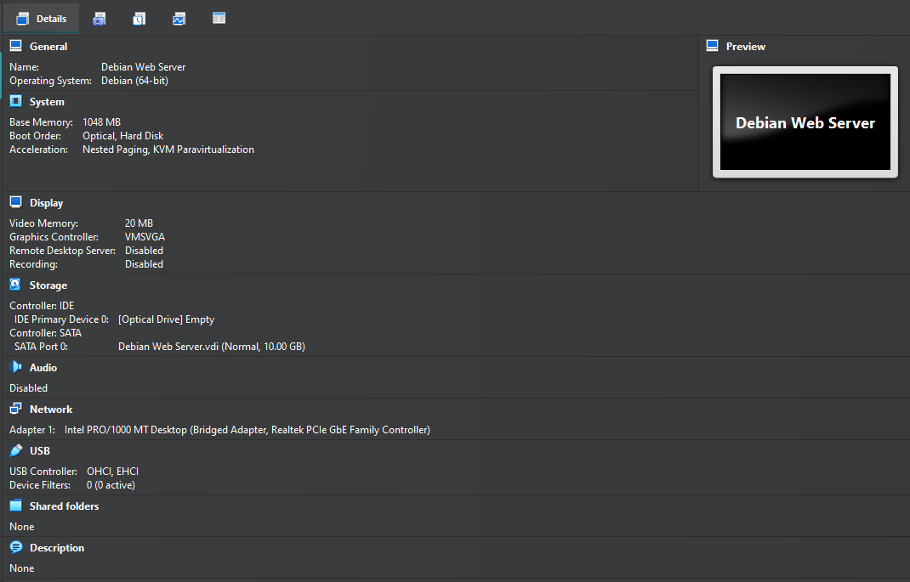
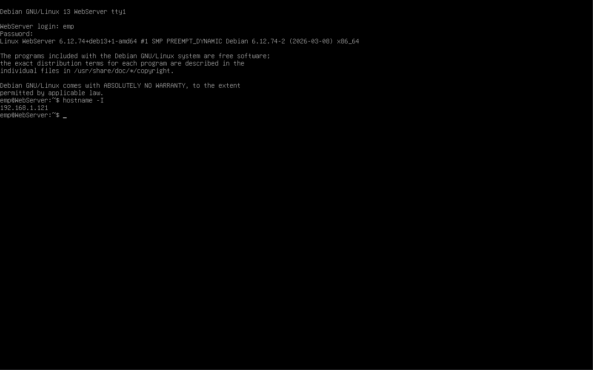
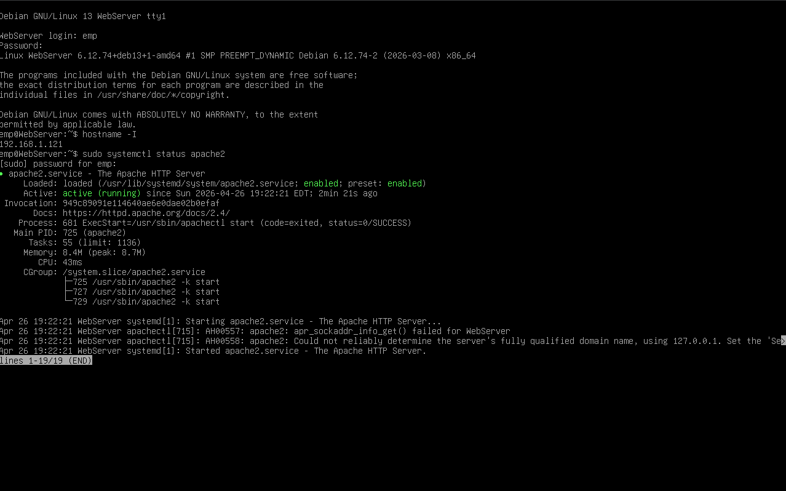

# Deliverable 2

#### 1. What are the server hardware specifications (virtual machine settings)?

#### 2. What is the Debian Login Screen?

#### 3. What is the IP address of your Debian Server Virtual Machine?

#### 4. How do you work with the Firewall in Debian? (Type and explain what each command does)

**Command name:** `ufw`

- **Description:** UFW (Uncomplicated Firewall) is the default and easiest way to manage the firewall in Debian. It simplifies iptables/nftables configuration.

- **Formula/Syntax:** `sudo ufw [option] [argument]`

- **Examples:**

  - How do you check if the Firewall is running?  
    By using the command `sudo ufw status`

  - How do you disable the Firewall?  
    By using the command `sudo ufw disable`

  - How do you add Apache to the Firewall?  
    By using the command:  
    `sudo ufw allow 'Apache'` (HTTP only - port 80)  
    `sudo ufw allow 'Apache Full'` (HTTP + HTTPS - ports 80 & 443)

---

##### Additional useful commands

- Detailed status: `sudo ufw status verbose`
- Reload rules: `sudo ufw reload`
- Enable firewall: `sudo ufw enable`

**Note:** Always allow SSH first with `sudo ufw allow OpenSSH` before enabling the firewall to avoid locking yourself out.

#### 5. What different commands do we use to work with Apache? (Type and explain what each command does and include a screenshot!)

**Command name:** `apache2` / `systemctl`

- **Description:** Apache on Debian uses `apache2` as the service name and `systemctl` to manage it. These commands allow you to control, test, and monitor the Apache web server.

- **Formula/Syntax:** `sudo systemctl [action] apache2` and `sudo apache2ctl [option]`

- **Examples:**

  1. What is the command you use to check if Apache is running?  
     By using the command `sudo systemctl status apache2`

  2. What is the command you use to stop Apache?  
     By using the command `sudo systemctl stop apache2`

  3. What is the command you use to restart Apache?  
     By using the command `sudo systemctl restart apache2`

  4. What is the command used to test Apache configuration?  
     By using the command `sudo apache2ctl configtest`

  5. What is the command used to check the installed version of Apache?  
     By using the command `apache2 -v`

  6. What are some common configuration files for Apache?  
     - Main configuration: `/etc/apache2/apache2.conf`  
     - Ports configuration: `/etc/apache2/ports.conf`  
     - Virtual hosts: `/etc/apache2/sites-available/000-default.conf`  
     - Enabled sites: `/etc/apache2/sites-enabled/`

  7. Where does Apache store logs?  
     Apache stores logs in: `/var/log/apache2/`  
     - Access log: `/var/log/apache2/access.log`  
     - Error log: `/var/log/apache2/error.log`

  8. What are some basic commands we can use to review logs?  
     - View last 50 lines: `sudo tail -n 50 /var/log/apache2/error.log`  
     - Follow logs in real-time: `sudo tail -f /var/log/apache2/access.log`  
     - View with less: `sudo less /var/log/apache2/error.log`

     