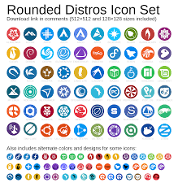

# Document 1

# What is Linux?

**A Professional Overview**

Linux is a free, open-source operating system that powers millions of devices worldwide — from smartphones and laptops to servers and supercomputers. Renowned for its stability, security, and flexibility, Linux offers a robust alternative to proprietary operating systems.

## What is Linux?

Linux is an operating system similar to Windows or macOS. At its heart is the Linux kernel, originally created by Linus Torvalds in 1991. The complete system is built on open-source principles, allowing anyone to view, modify, and distribute the source code.

### Key Components
1. **Kernel** — Manages hardware resources and core system functions.
2. **Bootloader** — Loads the operating system at startup.
3. **Desktop Environment** — The graphical interface users interact with.
4. **Package Manager** — Tool for installing and managing software.

## Why Choose Linux?

Linux stands out for several important reasons:

- **Free and Open Source** — No licensing costs and full transparency.
- **Security** — Highly resistant to viruses and malware.
- **Stability** — Servers can run for years without rebooting.
- **Customization** — Users can tailor the system to their exact needs.
- **Community Support** — Backed by a large, active global community.

### Popular Linux Distributions
- **Ubuntu** — Beginner-friendly with excellent hardware support
- **Linux Mint** — User-friendly, especially for Windows migrants
- **Fedora** — Modern software and strong developer focus
- **Debian** — Exceptional stability, ideal for servers
- **Pop!_OS** — Optimized for productivity and gaming

## The Linux Mascot

**Tux**, the friendly penguin, has been the official mascot of Linux since 1996.

## Linux Distribution Logos

## Desktop Environments

Linux offers a variety of desktop environments to suit different tastes and workflows.

**GNOME** — A modern, gesture-friendly interface focused on simplicity.  

**KDE Plasma** — Highly customizable with powerful features and widgets.  

## Comparison of Popular Distributions

| Distribution   | Best For                  | Default Desktop | Stability          | Target Users              |
|----------------|---------------------------|-----------------|--------------------|---------------------------|
| Ubuntu         | General Use               | GNOME           | High               | Beginners & Professionals |
| Linux Mint     | Ease of Use               | Cinnamon        | Very High          | Windows Migrants          |
| Fedora         | Latest Software           | GNOME           | High               | Developers & Enthusiasts  |
| Debian         | Servers                   | GNOME           | Extremely High     | Stability-Focused Users   |
| Pop!_OS        | Gaming & Productivity     | COSMIC          | High               | Modern Desktop Users      |

---
