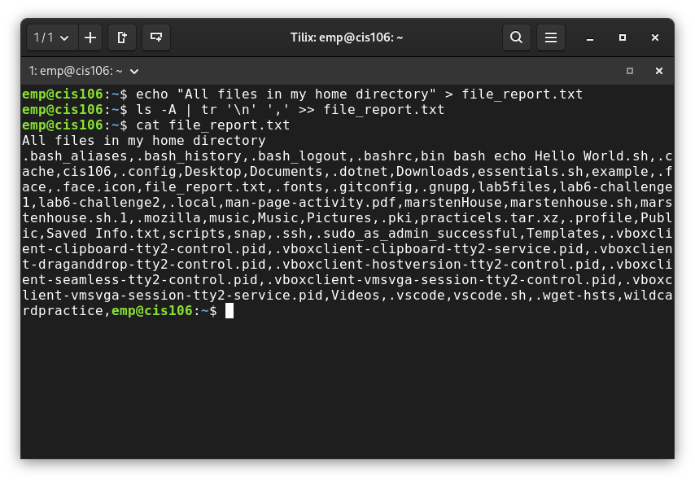
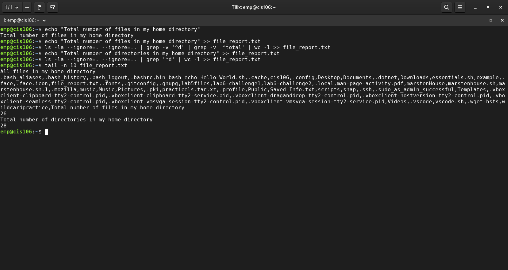
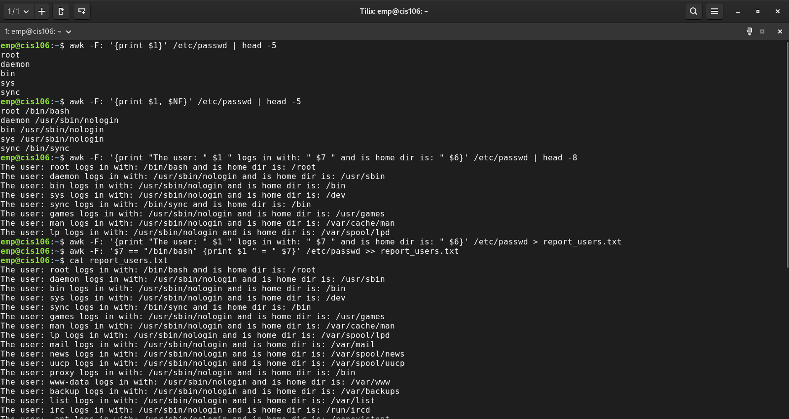
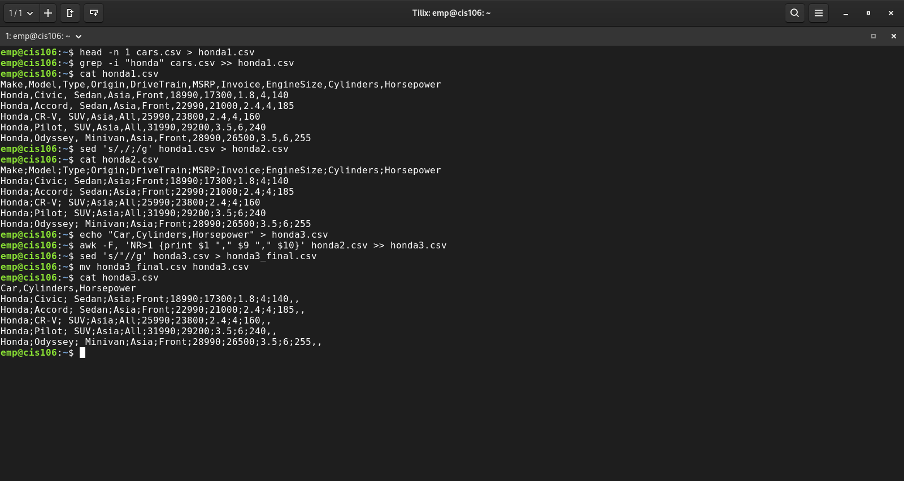
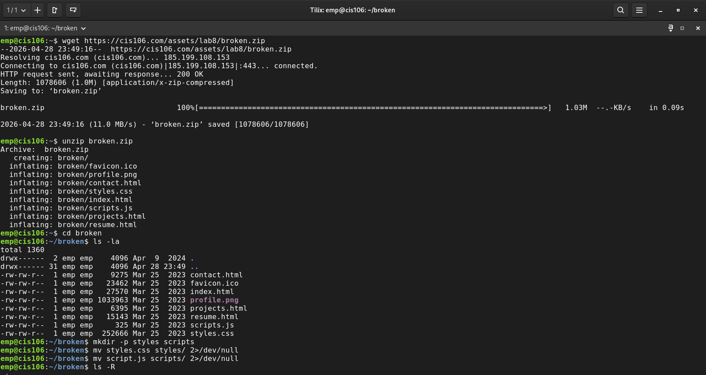
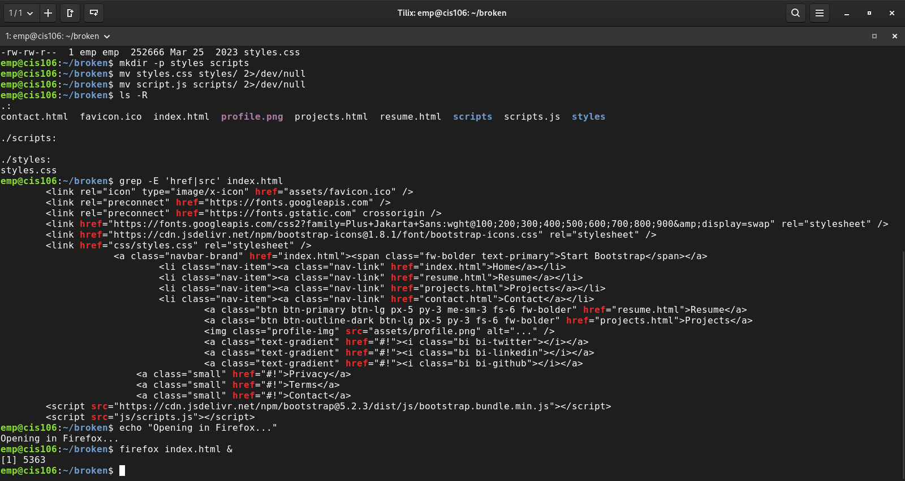
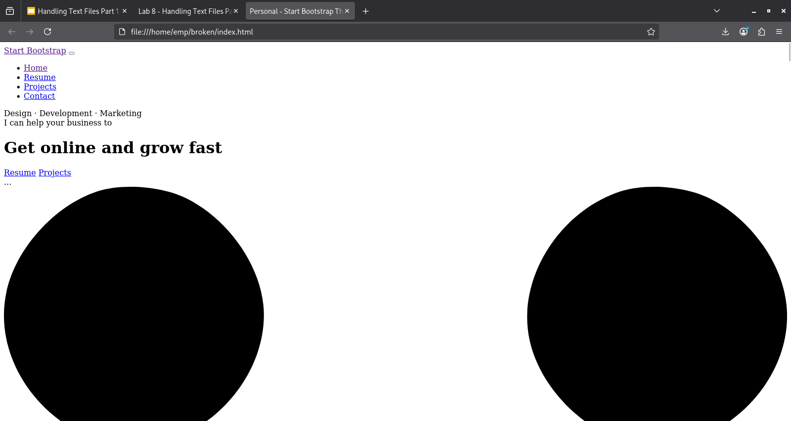

#### Lab 9
---

### Question 1: Working with saving commands output to a file

---

### Question 2: Working with the pipe (|)

---

### Question 3: awk Command

---

### Question 4: Working with CSV files

---

### Challenge Question: Fixing the Broken Website

**Directory Structure:**

**Working Website in Firefox:**

---
