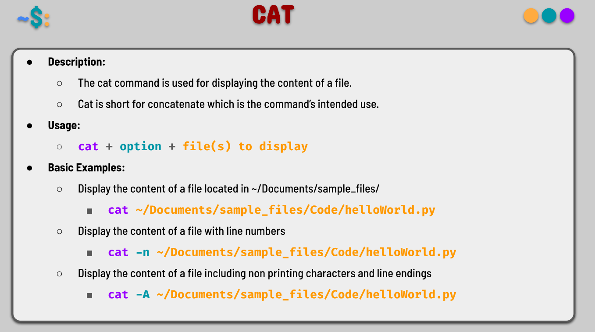
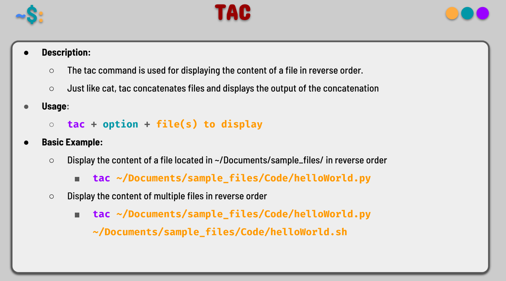
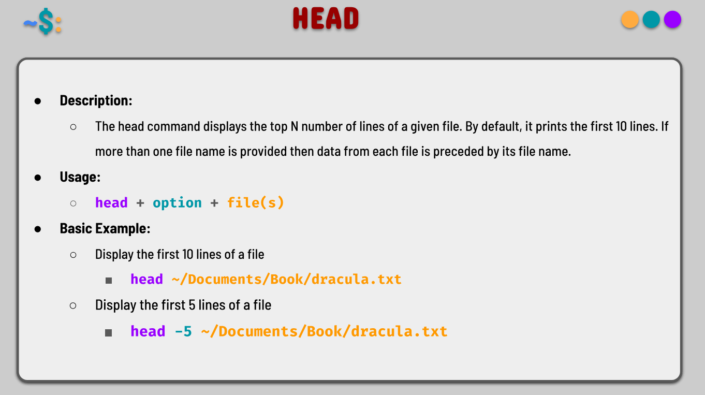
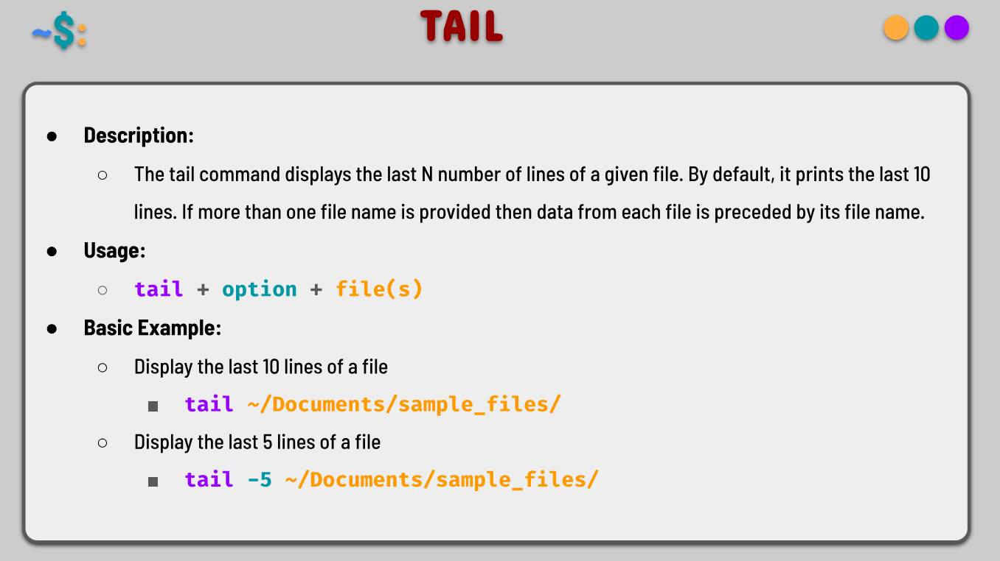
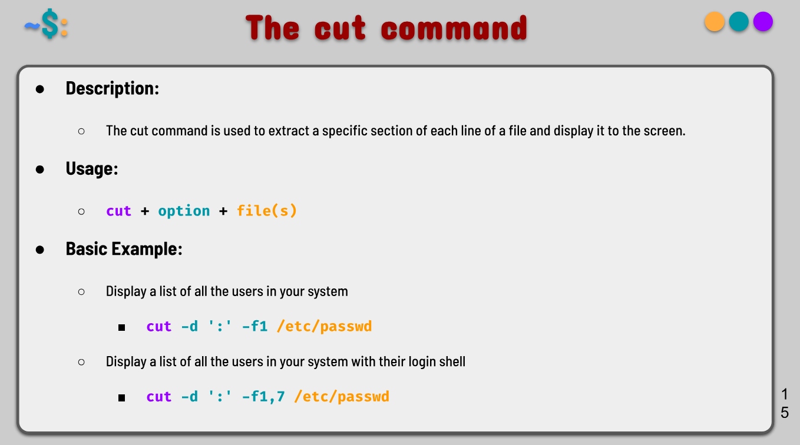
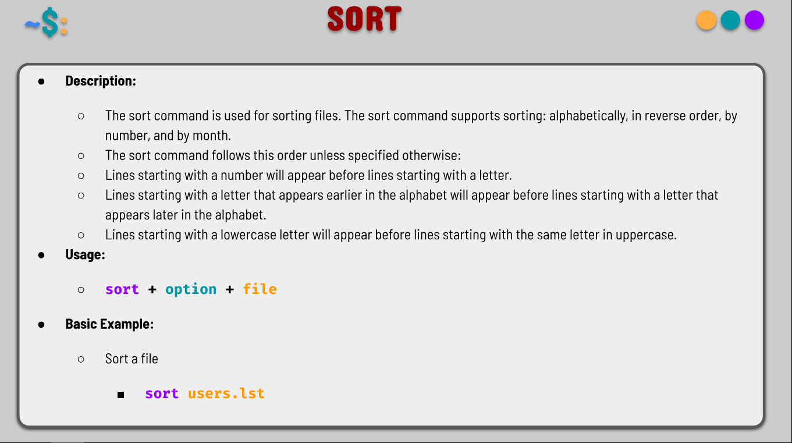
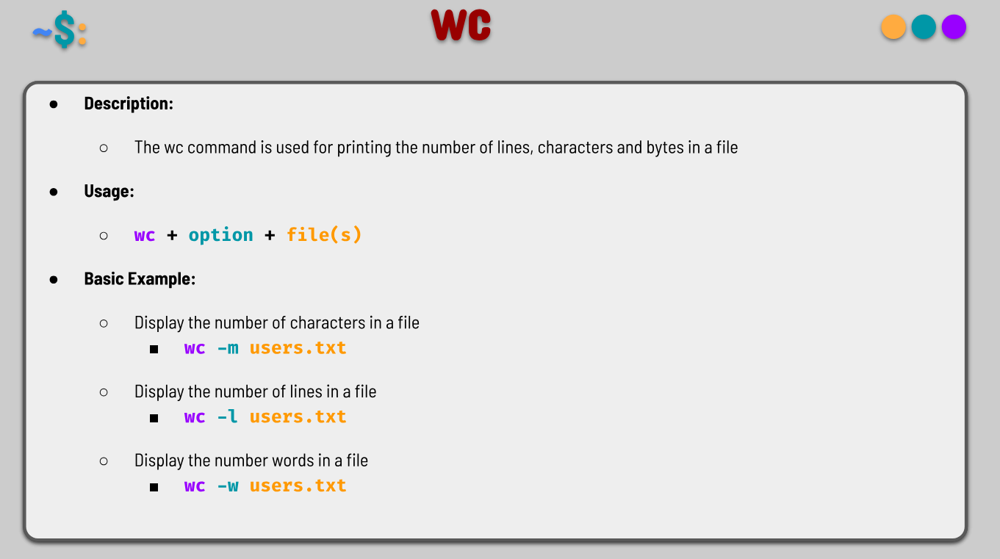

#### Notes 8

#### File and Text Processing Commands in Linux

#### cat

**Command name:** `cat`

- **Description:** Concatenates and displays the content of one or more files on the standard output (screen).

- **Formula/Syntax:** `cat [OPTION] [FILE]...`

- **Examples:**
  `cat file.txt` *Display content of a file*  
  `cat file1.txt file2.txt` *Display multiple files*  
  `cat -n file.txt` *Display content with line numbers*

---

#### tac

**Command name:** `tac`

- **Description:** Concatenates and prints files in reverse order (from last line to first).

- **Formula/Syntax:** `tac [OPTION] [FILE]...`

- **Examples:**
  `tac file.txt` *Display file content in reverse order*

---

#### head

**Command name:** `head`

- **Description:** Outputs the first part (beginning) of a file. By default, it displays the first 10 lines.

- **Formula/Syntax:** `head [OPTION] [FILE]...`

- **Examples:**
  `head file.txt` *Show first 10 lines*  
  `head -n 20 file.txt` *Show first 20 lines*  
  `head -c 100 file.txt` *Show first 100 characters*

---

#### tail

**Command name:** `tail`

- **Description:** Outputs the last part (end) of a file. By default, it displays the last 10 lines.

- **Formula/Syntax:** `tail [OPTION] [FILE]...`

- **Examples:**
  `tail file.txt` *Show last 10 lines*  
  `tail -n 50 file.txt` *Show last 50 lines*  
  `tail -f /var/log/apache2/error.log` *Follow log file in real-time*

---

#### cut

**Command name:** `cut`

- **Description:** Removes sections from each line of a file and outputs only selected portions (commonly used to extract columns or fields).

- **Formula/Syntax:** `cut [OPTION] [FILE]...`

- **Examples:**
  `cut -d':' -f1 /etc/passwd` *Extract usernames from /etc/passwd*  
  `cut -f1,3 file.txt` *Extract fields 1 and 3*  
  `cut -c1-10 file.txt` *Extract first 10 characters of each line*

---

#### sort

**Command name:** `sort`

- **Description:** Sorts lines of text files in ascending or descending order.

- **Formula/Syntax:** `sort [OPTION] [FILE]...`

- **Examples:**
  `sort file.txt` *Sort lines alphabetically*  
  `sort -n numbers.txt` *Sort numerically*  
  `sort -r file.txt` *Sort in reverse order*

---

#### wc

**Command name:** `wc`

- **Description:** Prints the number of lines, words, and characters in a file or from standard input.

- **Formula/Syntax:** `wc [OPTION] [FILE]...`

- **Examples:**
  `wc file.txt` *Show lines, words, and characters*  
  `wc -l file.txt` *Count lines only*  
  `wc -w file.txt` *Count words only*

