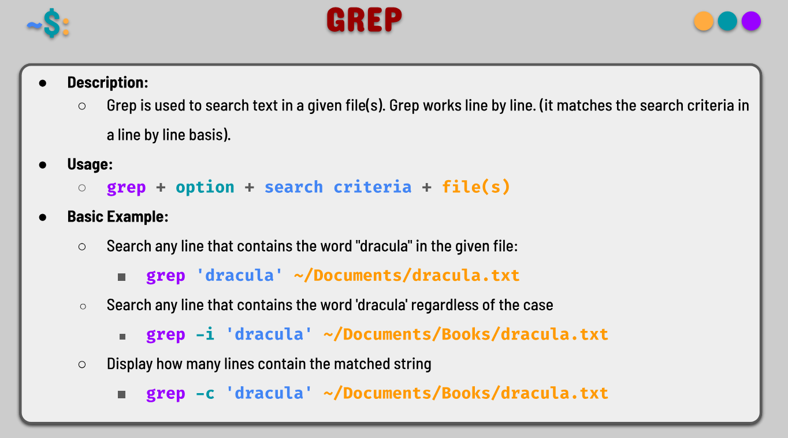
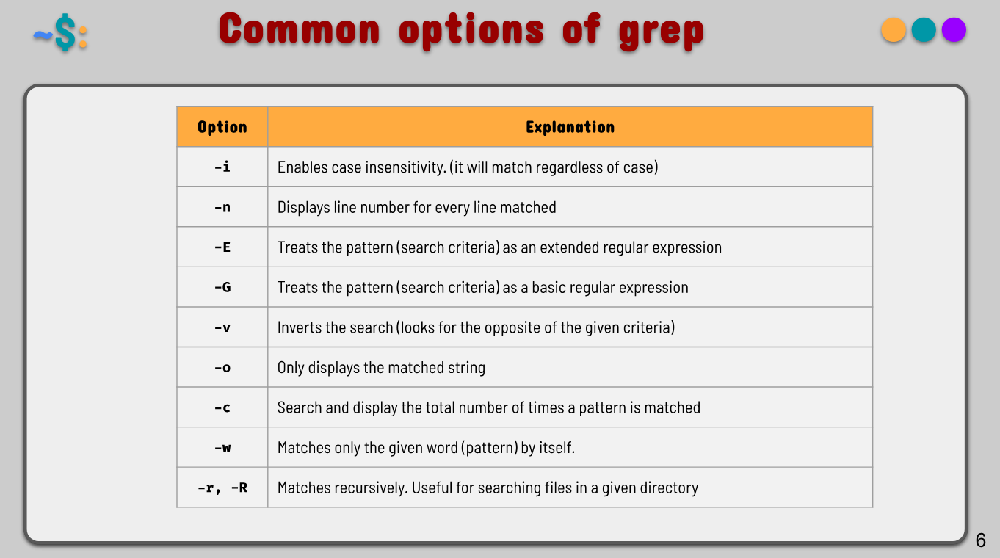
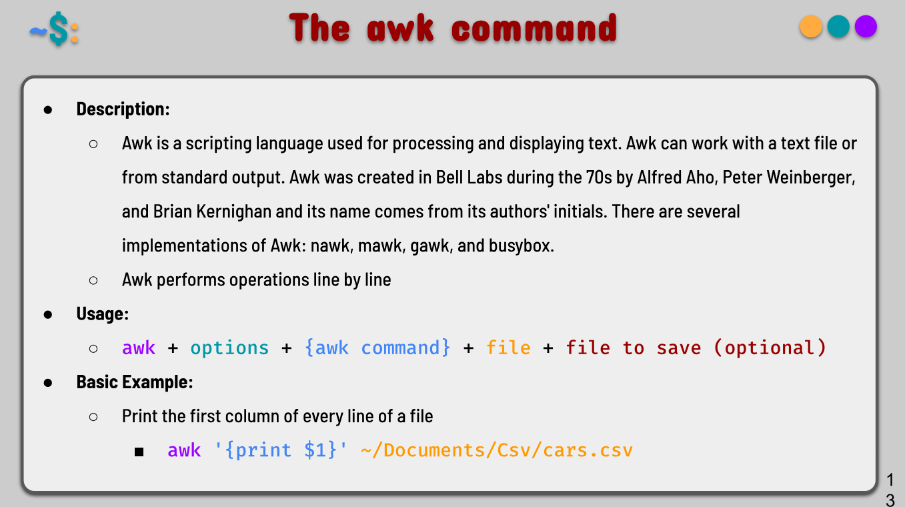
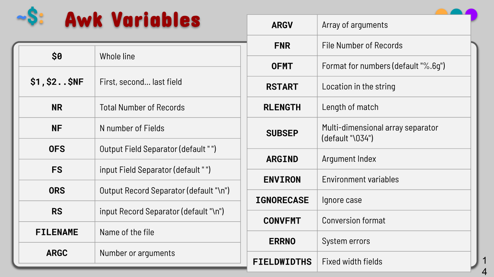
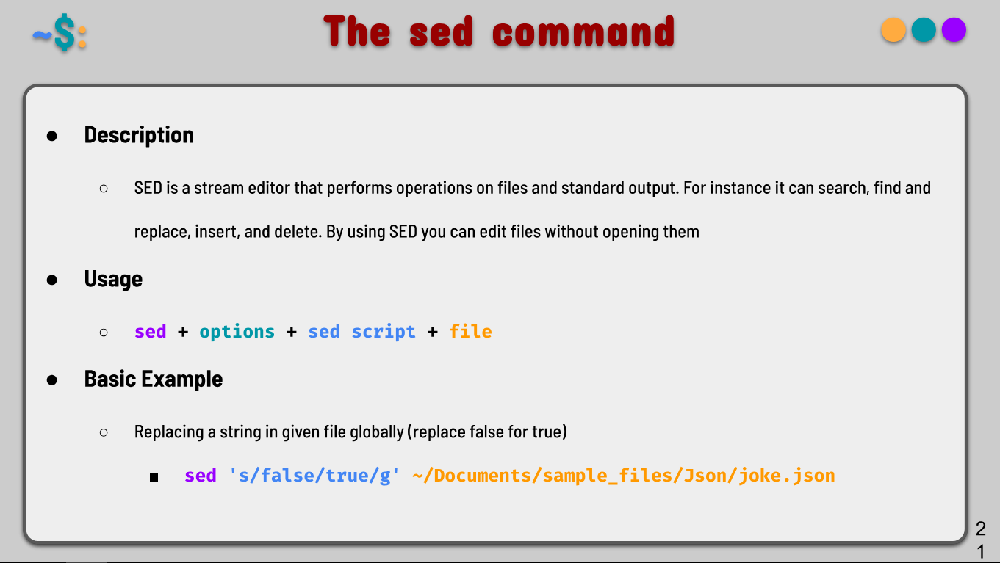
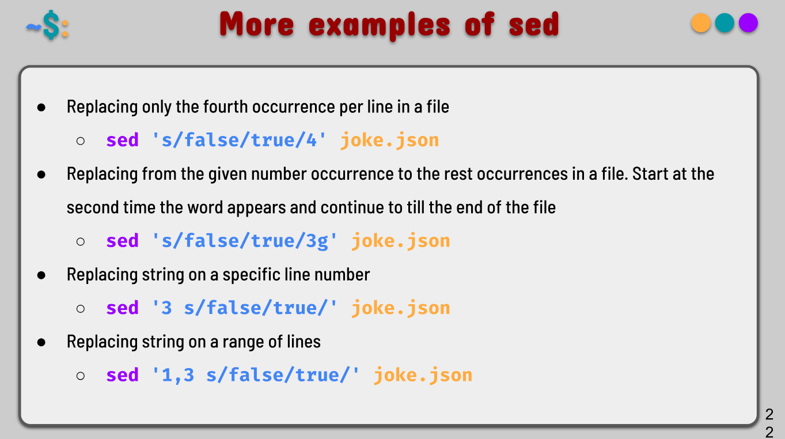

# Notes 9
---
## 1. grep

**Definition**  
`grep` stands for **Global Regular Expression Print**. It searches for specific patterns (text or regular expressions) in one or more files or input streams and prints the lines that match the pattern.

**Usage / Formula**  
`grep [OPTIONS] PATTERN [FILE...]`

**Common Options:**  
- `-i` → case-insensitive search  
- `-r` or `-R` → recursive search through directories  
- `-v` → invert match (show non-matching lines)  
- `-c` → count the number of matching lines  
- `-n` → show line numbers  
- `-E` → use extended regular expressions  
- `-l` → show only filenames that contain matches  

**Examples**  
`grep "error" app.log`  

`grep -ri "TODO" ./project/`  

`grep -n "function" script.sh`  

`grep -c "success" results.txt`  

`grep "localhost" /etc/hosts /etc/hostname`  

`ps aux | grep "nginx"`

  

---

## 2. awk

**Definition**  
`awk` is a powerful text-processing and data extraction tool. It works excellently with column-based (structured) text, allowing you to filter, calculate, and reformat data easily.

**Usage / Formula**  
`awk 'PATTERN { ACTION }' [FILE...]`

**Key Variables:**  
- `$1`, `$2`, ... → fields (columns)  
- `$0` → entire line  
- `NF` → number of fields in current line  
- `NR` → current line number  
- `BEGIN {}` → runs before processing  
- `END {}` → runs after processing  

**Examples**  
`awk '{print $1, $3}' data.txt`  

`awk '$3 > 100 {print $0}' sales.csv`  

`awk '{sum += $2} END {print "Total:", sum}' numbers.txt`  

`awk -F ',' '{print $1 " has score: " $2}' scores.csv`  

`ls -l | awk '{print $9}'`  

`awk 'BEGIN {print "Name\tScore"} {print $1 "\t" $2} END {print "Done"}' data.txt`

  

---

## 3. sed

**Definition**  
`sed` (**Stream Editor**) is a tool for filtering and transforming text. It is most commonly used for find-and-replace operations, deletions, and text substitutions using regular expressions.

**Usage / Formula**  
`sed [OPTIONS] 'SCRIPT' [FILE...]`

**Common Commands:**  
- `s/old/new/` → substitute (replace)  
- `s/old/new/g` → global replace on line  
- `d` → delete line  
- `-i` → edit file in place  

**Examples**  
`sed 's/error/warning/' app.log`  

`sed 's/foo/bar/g' file.txt`  

`sed 's/old/new/3' file.txt`  

`sed '/debug/d' app.log`  

`sed -i.bak 's/localhost/127.0.0.1/g' config.txt`  

`cat file.txt | sed 's/[0-9]/X/g'`

  
